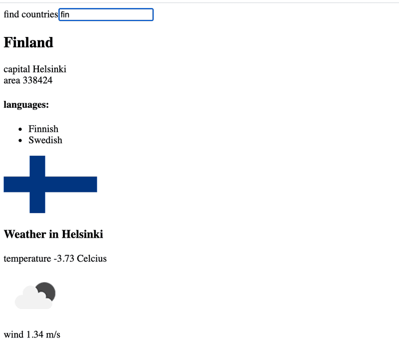

# Exercises

## 2.1 - 2.5: [courseinfo](https://github.com/jokerinya/fsopen-part2/tree/main/courseinfo)

## 2.12\* Data for countries, step1

The API https://restcountries.com provides data for different countries in a machine-readable format, a so-called REST API.

Create an application, in which one can look at data of various countries. The application should probably get the data from the endpoint all.

The user interface is very simple. The country to be shown is found by typing a search query into the search field.

If there are too many (over 10) countries that match the query, then the user is prompted to make their query more specific:  


If there are ten or fewer countries, but more than one, then all countries matching the query are shown:  


When there is only one country matching the query, then the basic data of the country (eg. capital and area), its flag and the languages spoken there, are shown:  


**NB:** It is enough that your application works for most of the countries. Some countries, like Sudan, can be hard to support, since the name of the country is part of the name of another country,
South Sudan. You don't need to worry about these edge cases.

**WARNING** `create-react-app` will automatically turn your project into a git-repository unless you create your application inside of an existing git repository. **Most likely you do not want each of
your projects to be a separate repository**, so simply run the `rm -rf .git` command at the root of your application.

## 2.13\*: Data for countries, step2

**There is still a lot to do in this part, so don't get stuck on this exercise!**

Improve on the application in the previous exercise, such that when the names of multiple countries are shown on the page there is a button next to the name of the country, which when pressed shows
the view for that country:  


In this exercise it is also enough that your application works for most of the countries. Countries whose name appears in the name of another country, like _Sudan_, can be ignored.

## 2.14\*: Data for countries, step3

**There is still a lot to do in this part, so don't get stuck on this exercise!**

Add to the view showing the data of a single country, the weather report for the capital of that country. There are dozens of providers for weather data. One suggested API is
https://openweathermap.org. Note that it might take some minutes until a generated api key is valid.  


If you use Open weather map, here is the description how to get weather icons.

**NB:** In some browsers (such as Firefox) the chosen API might send an error response, which indicates that `HTTPS` encryption is not supported, although the request URL starts with `http://`. This
issue can be fixed by completing the exercise using Chrome.

**NB:** You need an `api-key` to use almost every weather service. Do not save the `api-key` to source control! Nor hardcode the `api-key` to your source code. Instead use an environment variable to
save the key.

Assuming the api-key is _t0p53cr3t4p1k3yv4lu3_, when the application is started like so:

```bash
REACT_APP_API_KEY=t0p53cr3t4p1k3yv4lu3 npm start // For Linux/macOS Bash
($env:REACT_APP_API_KEY="t0p53cr3t4p1k3yv4lu3") -and (npm start) // For Windows PowerShell
set "REACT_APP_API_KEY=t0p53cr3t4p1k3yv4lu3" && npm start // For Windows cmd.exe
``
```

you can access the value of the key from the `process.env` object:

```js
const api_key = process.env.REACT_APP_API_KEY;
// variable api_key has now the value set in startup
```

Note that if you created the application using `npx create-react-app ...` and you want to use a different name for your environment variable then the environment variable name must still begin with
`REACT_APP_`. You can also use a .envfile rather than defining it on the command line each time by creating a file entitled `.env` in the root of the project and adding the following.

```bash
# .env

REACT_APP_API_KEY=t0p53cr3t4p1k3yv4lu3
```

Note that you will need to restart the server to apply the changes.

## 2.6 - 2.11, 2.15 - 2.20: [phonebook](https://github.com/jokerinya/fsopen-part2/tree/main/phonebook)
