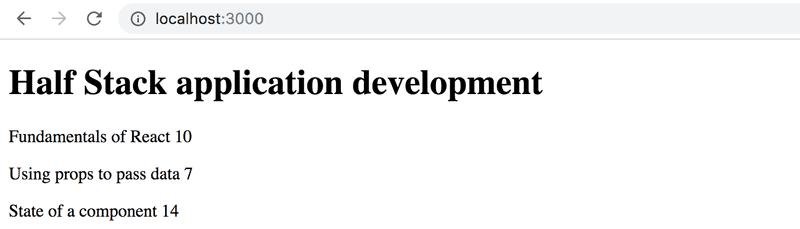
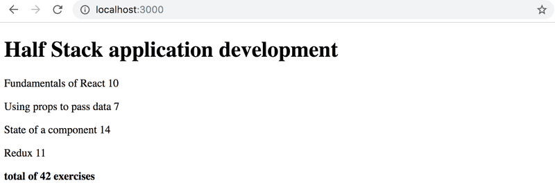
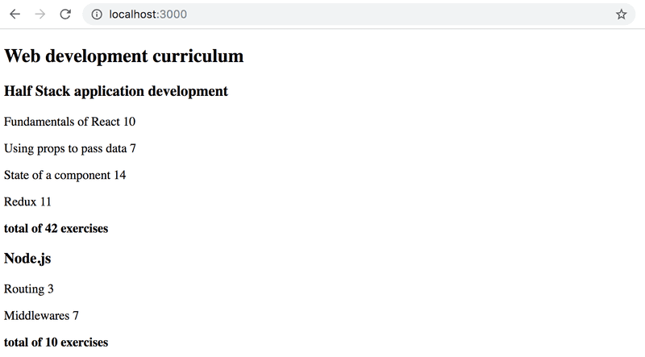

# Exercises

> ## Exercises 2.1.-2.5.

The exercises are submitted via GitHub, and by marking the exercises as done in the [submission system](https://studies.cs.helsinki.fi/stats/courses/fullstackopen).

You can submit all of the exercises into the same repository, or use multiple different repositories. If you submit exercises from different parts into the same repository, name your directories well.

The exercises are submitted **One part at a time**. When you have submitted the exercises for a part, you can no longer submit any missed exercises for that part.

Note that this part has more exercises than the ones before, so do not submit before you have done all exercises from this part you want to submit.

**WARNING** `create-react-app` makes the project automatically into a git-repository, if the project is not created inside of an already existing repository. You probably **do not** want the project to become a repository, so run the command `rm -rf .git` from its root.

## 2.1: Course information step6

Let's finish the code for rendering course contents from exercises 1.1 - 1.5. You can start with the code from the model answers. The model answers for part 1 can be found by going to the [submission system](https://studies.cs.helsinki.fi/stats/courses/fullstackopen), click on my submissions at the top, and in the row corresponding to part 1 under the solutions column click on show. To see the solution to the course info exercise, click on `index.js` under kurssitiedot ("kurssitiedot" means "course info").

**Note that if you copy a project from one place to another, you might have to delete the node_modules directory and install the dependencies again with the command `npm install` before you can start the application.** Generally, it's not recommended that you copy a project's whole contents and/or add the node_modules directory to the version control system.

Let's change the App component like so:

```js
const App = () => {
    const course = {
        id: 1,
        name: 'Half Stack application development',
        parts: [
            {
                name: 'Fundamentals of React',
                exercises: 10,
                id: 1,
            },
            {
                name: 'Using props to pass data',
                exercises: 7,
                id: 2,
            },
            {
                name: 'State of a component',
                exercises: 14,
                id: 3,
            },
        ],
    };

    return <Course course={course} />;
};

export default App;
```

Define a component responsible for formatting a single course called Course.

The component structure of the application can be, for example, the following:

```bash
App
  Course
    Header
    Content
      Part
      Part
      ...
```

Hence, the _Course_ component contains the components defined in the previous part, which are responsible for rendering the course name and its parts.

The rendered page can, for example, look as follows:


You don't need the sum of the exercises yet.

The application must work _regardless of the number of parts a course has_, so make sure the application works if you add or remove parts of a course.

Ensure that the console shows no errors!

## 2.2: Course information step7

Show also the sum of the exercises of the course.


## 2.3\*: Course information step8

If you haven't done so already, calculate the sum of exercises with the array method reduce.

**Pro tip:** when your code looks as follows:

```js
const total = parts.reduce((s, p) => someMagicHere);
```

and does not work, it's worth to use console.log, which requires the arrow function to be written in its longer form:

```js
const total = parts.reduce((s, p) => {
    console.log('what is happening', s, p);
    return someMagicHere;
});
```

**Not working? :** Use your search engine to look up how reduce is used in an Object Array.

**Pro tip 2:** There is a plugin for VS Code that automatically changes short form arrow functions into their longer form, and vice versa.


## 2.4: Course information step9

Let's extend our application to allow for an arbitrary number of courses:

```js
const App = () => {
    const courses = [
        {
            name: 'Half Stack application development',
            id: 1,
            parts: [
                {
                    name: 'Fundamentals of React',
                    exercises: 10,
                    id: 1,
                },
                {
                    name: 'Using props to pass data',
                    exercises: 7,
                    id: 2,
                },
                {
                    name: 'State of a component',
                    exercises: 14,
                    id: 3,
                },
                {
                    name: 'Redux',
                    exercises: 11,
                    id: 4,
                },
            ],
        },
        {
            name: 'Node.js',
            id: 2,
            parts: [
                {
                    name: 'Routing',
                    exercises: 3,
                    id: 1,
                },
                {
                    name: 'Middlewares',
                    exercises: 7,
                    id: 2,
                },
            ],
        },
    ];

    return <div>// ...</div>;
};
```

The application can, for example, look like this:


## 2.5: separate module

Declare the `Course` component as a separate module, which is imported by the `App` component. You can include all subcomponents of the course into the same module.

## 2.6 - 2.11, 2.15 - 2.20: [phonebook](https://github.com/jokerinya/fsopen-part2/tree/main/phonebook)

## 2.12 - 2.14: [countries](https://github.com/jokerinya/fsopen-part2/tree/main/countries)
